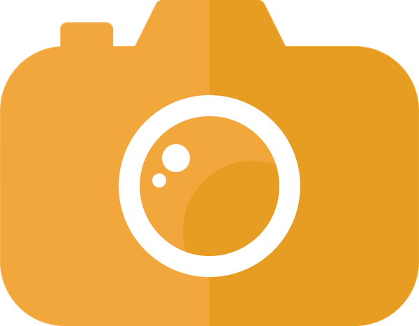

<p align="center">
  
</p>

<h1 align="center">Best Photo Picker</h1>

<p align="center">
  <b>On-device AI that culls burst photography for you — without ever touching your originals.</b>
</p>

<p align="center">
  
  
  
  
</p>

## ▶ Demo

A one-minute walkthrough — import a shoot, let it score, review the keepers:

<p align="center">
  <a href="https://youtu.be/2DZ53H-eefU">
    
  </a>
</p>

<p align="center"><a href="https://youtu.be/2DZ53H-eefU">▶ Watch on YouTube</a></p>

## Why this exists

Shoot in continuous mode and a single moment becomes 20, 40, 80 near-identical frames. A
wedding, a sports afternoon, a kid's birthday — a card fills with thousands of photos that
differ by a blink, a twitch of focus, a hair of motion blur. The keepers are in there. Finding
them by hand means squinting at near-duplicates for hours.

Existing "AI cullers" mostly live in the cloud (upload your private photos to someone's server)
or quietly **move and delete** files to do their job. Best Photo Picker does neither:

- **Everything runs on your machine.** No upload, no account, no network. Your photos never
  leave the disk.
- **It never moves or deletes an original.** Scoring only writes a CSV; sorting is symlink-only
  and opt-in. This is the whole point of the tool, not a setting —
  see [`docs/adr/0001`](docs/adr/0001-manifest-first-never-move-originals.md).

## What it does

Point it at a folder of JPEGs (local or a NAS). It:

1. **Groups** near-identical frames into **bursts** — by capture-time gap, or by visual
   near-duplicate similarity (camera-agnostic).
2. **Finds the subject** in each frame (the face, when there are people) and locks one region
   across the whole burst, so every frame is judged on the same pixels.
3. **Picks the best of each burst** — a **keeper** — and explains *why* in plain language
   ("sharpest of 14", "eyes closed", "blown highlights").
4. Leaves everything else as **maybe** (your call) or **rejected** (high-confidence trash) —
   but biased to *maybe*, because burying a good shot is worse than surfacing a bad one.

Nothing is hidden behind a black-box score. The output is a **manifest** — one row per photo
with its burst, subject, sharpness, eye check, exposure, bin, and reason — that you can read,
sort, and hand-edit before anything gets staged for review.

### How it decides — gate, then rank

It is deliberately *not* one blended "quality score":

- **Eyes-open is a hard gate** for a single-person portrait — a tack-sharp photo with closed
  eyes is still a reject. In group shots it softens into a face-size-weighted rank (the people
  up front matter, the bystander at the back doesn't).
- **Exposure is a soft flag**, never a reject — some frames are dark or bright on purpose.
- **Sharpness** (focus / motion blur) is the axis the survivors are ranked on.
- **When unsure, it picks `maybe`** — never `rejected`. Rejection is reserved for the
  obviously-bad.

Two detection models do what each is good at: **YuNet** finds faces robustly in real scenes,
and **MediaPipe FaceLandmarker** reads eye-open from blendshapes per face
([`docs/adr/0003`](docs/adr/0003-yunet-for-detection-landmarker-for-eyes.md)).

## Two ways to run it

### The macOS app

A native SwiftUI app that drives the engine end to end — drag in a shoot, watch it score,
review keepers/maybes side by side, star your **favourites**, and export them to a new folder.
Self-updating via Sparkle. (See the [demo](#-demo) above.)

### The CLI

For scripting, servers, and NAS workflows. Uses [uv](https://docs.astral.sh/uv/); Python 3.11+.

```bash
uv sync --extra faces                                    # deps incl. face/eye detection
uv run bestphoto score  <photos> -m manifest.csv         # score into a manifest (moves nothing)
uv run bestphoto review <photos> -m manifest.csv -o ~/review   # stage keepers as symlinks
uv run bestphoto contact <photos> -m manifest.csv -o sheet.html  # HTML contact sheet to eyeball
```

`score` is **resumable** (it caches per-photo measurements, so re-runs skip unchanged files).
Full CLI usage, tuning, grouping strategies, and known limits live in
[`core/README.md`](core/README.md).

## Repository layout

| Path | What |
|---|---|
| [`core/`](core/) | The Python engine + `bestphoto` CLI — all grouping, detection, scoring. The single source of truth; runs anywhere. ([`core/README.md`](core/README.md)) |
| [`macos/`](macos/) | The native SwiftUI app that drives the core ([`docs/adr/0005`](docs/adr/0005-native-macos-app-over-python-core.md)). |
| [`docs/`](docs/) | Architecture Decision Records ([`adr/`](docs/adr)) — the *why* behind the design. |
| [`CONTEXT.md`](CONTEXT.md) | Domain vocabulary — the source of truth for terms (Keeper, Burst, Subject, Gate, …). |

It's a [uv](https://docs.astral.sh/uv/) workspace: the Python package lives in `core/` (PyPI:
`best-photo-picker`), `uv.lock` is the single workspace lock at the root, and tests run from
`core/` (`uv run --directory core pytest`). See
[`docs/adr/0007`](docs/adr/0007-monorepo-core-macos-layout.md).

## Design decisions

The *why* behind the surprising choices is written down in [`docs/adr/`](docs/adr) — manifest-first
non-destruction, score-on-Mac / stage-as-symlinks, the two-model detection split, the two
grouping strategies, app-over-script, and more. Read those before changing grouping, output, or
detection.

## License

[MIT](LICENSE) © iYasha
